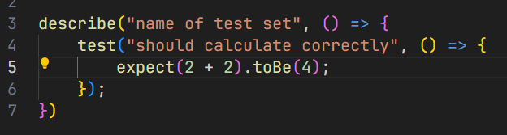
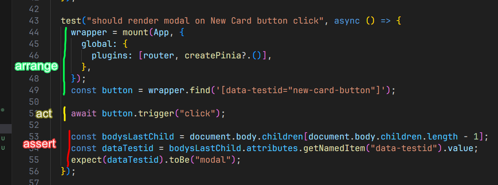
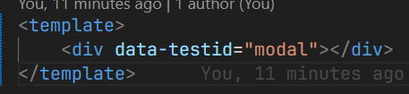

# Задача

## Setup

`npm install` для установки зависимостей.\
`npm run dev` для запуска дев-сервера.\
`npm run test` для запуска тестов Vitest.

## Описание

В данном репозитории вам предлагается решить задачу в формате Test Driven Development (TDD), в папке tests присутствует файл с тестами Vitest, которые вам предстоит "озеленить". Для запуска тестов используйте команду `npm run test`.

При запуске вы увидите такую картину:

Подробные требования описаны в самих тестах, которые вы можете прочитать в `tests/cards.spec.js`

В итоге наши тесты будут выглядеть так:

## Цель
#### Наша задача изменить приложение так, чтобы все тесты успешно проходили. Для этого нам будет необходимо добавить функциональность:
- Добавить модальное окно, для добавления карты в список, компонент AddCardModal.vue
- Добавить поле ввода для фильтрации карт
- Добавить отдельную страницу по пути `/card/:number` с информацией о карте

## Что ещё нужно знать?

Для успешного выполнения этого задания вы уже обладаете всеми необходимыми знаниями по Vue, но здесь мы будем также читать unit-тесты, они по сути и являются нашим ТЗ. Немного о том, как это работает и что с этим делать.

### Структура тестов
Тесты пишутся с использованием библиотеки Vitest. Давайте взглянем на пример файла теста:

Весь тест написан с помощью javascript функций. В функцию `describe` мы передаем название нашего тест-сета, и далее в колбеке описываем сами тесты. Функция `test` принимает в себя описание тест-кейса и колбек с самим тестом. Описание принято описывать в формате "что должно произойти", поэтому часто пишут названия в формате "should calculate correctly". Также есть семантический аналог функции "test" - "it". В итоге у нас получается семантическая запись `it("should calculate correctly", callback)`

### Arrange, Act, Assert
Тесты принято делить на три фазы, стадию подготовки приложения/юнита к тестированию - Arrange. Стадию действия, то есть сами действия с приложением, которые мы проверяем - Act, и стадию подтверждения, проверки правильности логики приложения - Assert.
В нашем примере выше мы видим только стадию Assert: `expect(2 + 2).toBe(4)`. Тест проверяет, что значение в "expect" равно значению в "toBe". Если это окажется неверно, например мы напишем `expect(1 + 1).toBe(4)` - при запуске тестов он провалится, нам укажет на ошибку и что мы получили в expect вместо ожидаемого результата:

Все три стадии можно увидеть в этом тесте:

Сначала мы готовимся к тестам. С помощью vue-test-utils, созданных для тестирования компонентов мы монтируем нужный компонент, настроиваем и в уже смонтированном компоненте находим кнопку.
Далее, в стадии действия, мы нажимаем на эту кнопку.
И в конце мы проверяем, привели ли наши действия к желаемому результату. 

### data-testid
Для поиска нужных элементов в наших тестах мы часто используем поиск по test id. Обратите на это внимание, если вы написали функциональность, но тест всё ещё красный, возможно тесты не могут найти нужные элементы.

Убедитесь, что ваши элементы имеют необходимый дата атрибут testid. 

## Работа с git

`git clone {путь к git-репозиторию}` для клонирования проекта (в нашем случае "https://github.com/reirra/mephi_test-task.git" по https, "git@github.com:reirra/mephi_test-task.git" по ssh).\
`git checkout -b {название-ветки}` для создания отдельной ветки.\
`git add .` для добавления всех изменённых файлов в stage (локальное сохранение изменённых файлов).\
`git commit -m "{описание изменений}"` для создания коммита в ветке из сохранённых файлов в stage.\
`git push origin HEAD` для отправки коммитов в удалённый репозиторий.\

## Создание Pull Request

 Заходите во вкладку Pull requests -> нажимаете New pull request, выбираете свою ветку из списка в compare (она должна повиться после команды `git push origin HEAD` из раздела "Работа с git") и нажимаете "Create pull request"

### Ссылки
Если в процессе чтения тестов вам будет непонятно, что делает та или иная запись, вы можете обратиться к документации Vitest и vue-test-utils.

https://vitest.dev/

https://test-utils.vuejs.org/
